# MadTalk - A Feature-Rich Dialog System for Godot
_Empowering mad dialogue since 2020_ _o/_

_This branch is the Godot 4.x version **starting at Godot 4.4** (due to changes in GraphNode and Resource). If you use Godot 3, check the `3.x` branch. For Godot 4.0 or 4.1, use the `4.1` branch._

&nbsp;


&nbsp;

MadTalk is one of the oldest and largest (in features) dialog plugins made for Godot - it's the dialog plugin behind almost all Mad Parrot games with dialogs, and some others. It's feature-rich, mature, genre and layout agnostic, focused on visual editing, beginner friendly (as possible) while remaining powerful enough for advanced users.

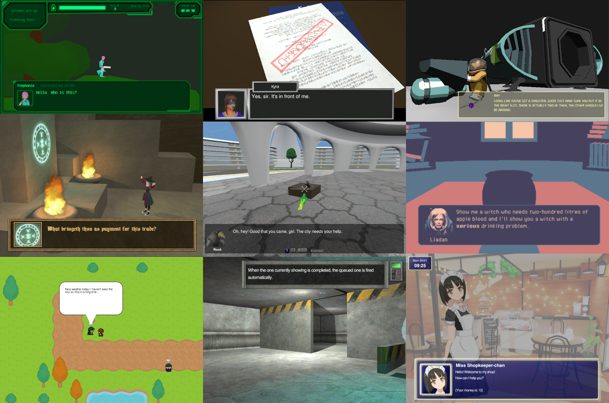

It can be used in any type of game, and coupling it to game code or not is entirely your option. You can use it just to show some messages, or if you want you can go all the way into using it as a framework.

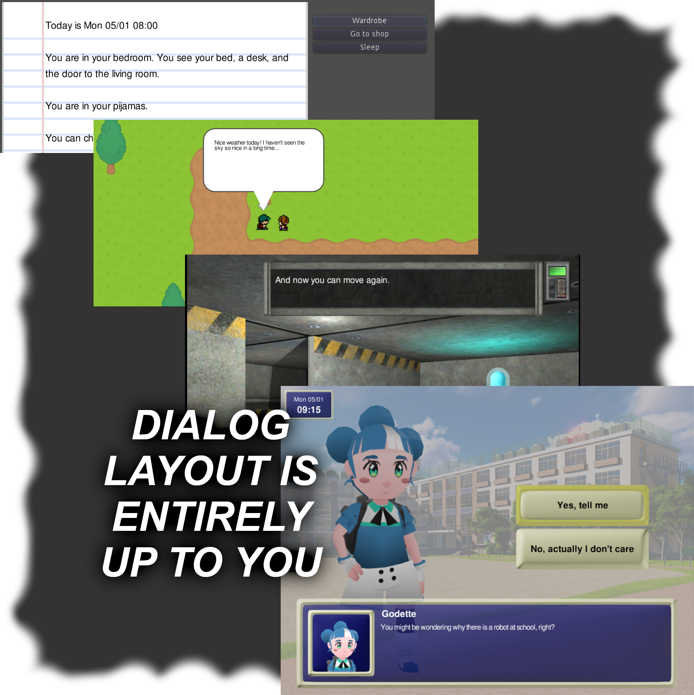

You can check a feature showcase in the [example project](https://madparrot.itch.io/madtalk-example-project) _(be aware that project is a few years old, so if it feels outdated it's because it is)_.

If you want to play a game using MadTalk to see it in real life, one example is [Ciara and the Witch's Cauldron](https://subvertissement.itch.io/ciara-and-the-witchs-cauldron).

----

&nbsp;

### Opinionated

Other dialog plugins are made to be very generic and neutral - which is good in itself, but might be daunting (or even confusing) for beginners.

MadTalk on the [otter hand](docs/otter_hand.png) is not afraid of getting specific, and thrives in its unique set of features (some which are specifically helpful for some game genres) putting it aside from average dialog systems around. 

  * **Node-based, but _it's compact and clean!_** (no spaghetti)
  * **Conditional branching and effects, intuitively** (doesn't look like Scratch software)
  * Handles **in-game time _(the only Godot dialog plugin doing that!)_**
  * Supports **voice acting** and **translations _in the plugin itself_**, including localised voice lines (no need for CSVs and IDs)
  * **Import/Export** dialog data to/from other formats
  * **Compatible with the [Baked Lipsync](https://github.com/fbcosentino/godot-baked-lipsync) plugin** (in fact, baked lipsync was developed inside MadTalk, but spinned off)

~~(Truth be said: MadTalk is opinionated because it was made when the famous dialog plugins didn't exist yet, so there was nothing around to take inspiration from. So I just made it how I needed it to be for my use case.)~~

&nbsp;

----

&nbsp;

### Compact Visual Editor 

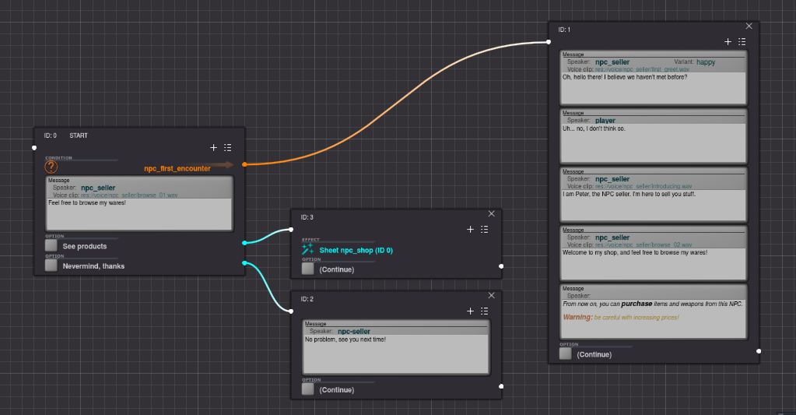
  
  * Editor uses visual nodes (dialog diagrams don't look like Scratch software)
  * Visualizing diagrams is very compact, screen space used is clean and neat due to the _sequence_ model: all blocks of dialog have a main path, and everything which doesn't branch from main path is a _sequence_, shown in the same node as a stack (visually similar to blender modifier stack)
  * Layouts are not cluttered with lines all around, only uses lines for actual branching between sequences (no separate nodes for `if`s, setting variables, etc)
  * Dialog sequences are organised in sheets, which are exactly what it says on the tin. Any point of any dialog can jump to any point of any other sheet without needing lines
  * Editing messages includes a panel for real time _bbcode_ visualization
  * Nearly all options and features anywhere in the plugin include a question mark button with a help popup explaining what that is and how to use it, so you don't need lots of documentation browsing to know how to use things
 


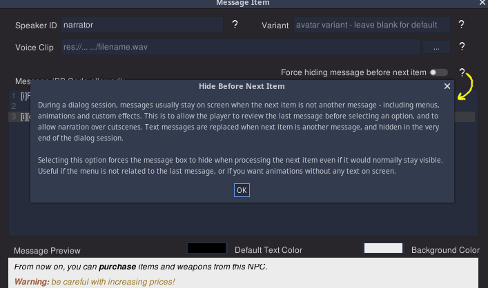

  
&nbsp;

----

&nbsp;
  
### Offloads Game Logic (if you want)

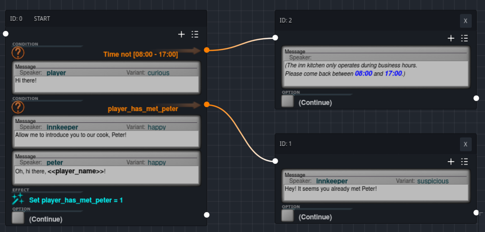

  * Conditions and effects allow you to control the dialogs from within the dialogs, making designing it more intuitive (compared to code scattered around the project)
  * The dialog diagrams double as a form of visual scripting, so depending on the type of game (e.g. visual novels) you can bring a lot (or even all!) of game logic into it for free and reduce the coding effort
  * All of the above is optional, and MadTalk will not get in the way of your code if you prefer to do everything by hand. You can also have a middleground with best of both worlds, using custom conditions and effects triggering signals and evaluation methods to decide branching via your own code even in the middle of sequencing
  * Again, each condition and effect comes with their own question mark explaining the parameters
  
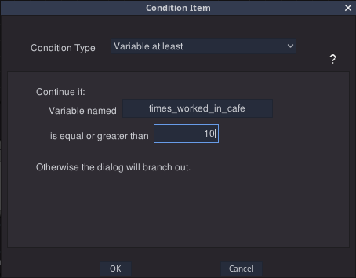

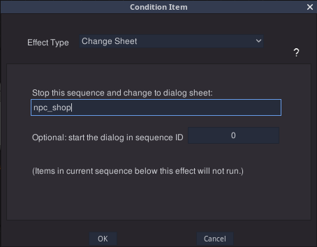


  
  
&nbsp;

----

&nbsp;


### Full Feature Set for In-Game Time handling

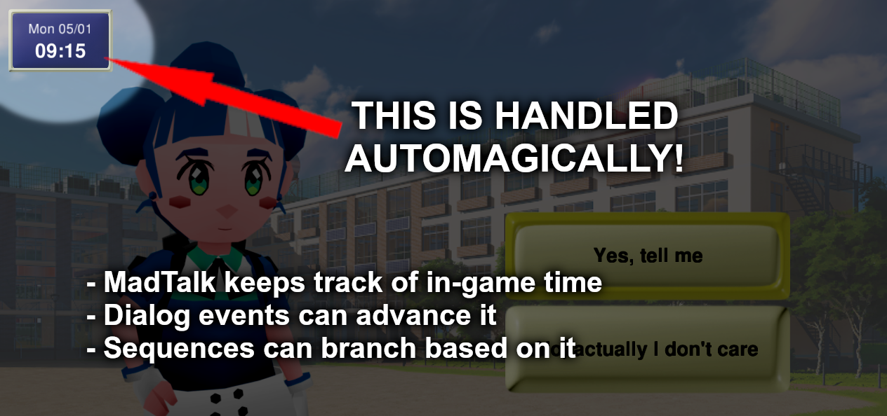

This is the point where MadTalk excels: some games (iconic example being _Harvest Moon_ and slice-of-life visual novels) have an in-game time and calendar, actions spend time, and some dialog branches and game events are affected by it (e.g. something different happens if you talk to that NPC on a Saturday evening).

MadTalk has an entire subsystem to handle in-game time automatically for you:

  * A set of effects available in dialog sequences to advance time in several ways (adding time or days, moving clock/calendar to a certain time/date, stamping current in-game time into a variable)
  * A set of conditions for dialogs to branch, based on in-game time (several options for time/date range, and time spent since a timestamp from a variable)
  * In-game time controlled by MadTalk can be read and written by your code from anywhere so you don't have to rely on dialog effects at all for controlling and/or fine tuning it
  
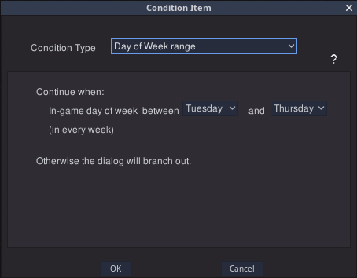


There are more features, such as handling animations (with or without narration text), typing sounds, and some other bonbonnière. Again, you _don't have_ to use any of those features. If you want to just show some message sequences in the game UI, it will work too and will not get in your way. 

Also, as is customary in dialog plugins, you can also have ye olde conditional text inside message content as well, but they can't branch the sequences if they are inside text. They only change what is shown in the message.

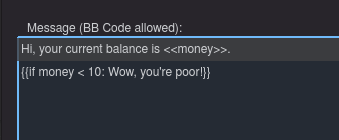

&nbsp;

----

&nbsp;

### Localized Messages From Inside the Dialog Editor

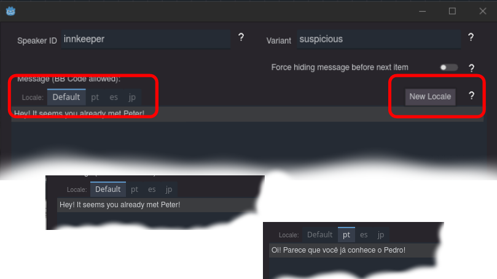

You don't have to use spreadsheets and place IDs in your dialog messages (leave the translation CSVs for your UI). You can type different languages directly into the message boxes, easily creating new tabs for languages as you go. 

  * You keep all the dialog text for the message grouped in one place, where it logically belongs
  * You work with your real text as you go (instead of having to keep track of IDs)
  * When you redesign the dialog changing connections and moving items around, all the translations follow as one whole thing
  
**Voice acting is also included in localisation!** You can provide localised audio clips for each message, or you can localize only the text and still play the audio from the original language - up to you. You can even mix both: have some languages with their own audio, and some other languages using the default audio.

&nbsp;

----

&nbsp;

### Import and Export - Great for Writers and Translators

You can write your dialogue like a book writer would, typing into a text editor - and then just paste into the MadTalk importer. As long as you follow the format below (more formats to be added in the future - requests welcome!), the plugin will create all the sequences and items automatically for you.

Example: 

```
[Sequence]
alice: Hey Bob! How are you?
bob: I'm great! Not having any headaches at all lately.
alice: Nice! Good to know the unobtanium medicine is working!
narrator: [i]That was the last time Alice saw Bob alive.[/i]

[Sequence]
alice: I miss my friend so much...
alice: Anyways, time to go.
```

You can also export existing dialog sheets to this format, and MadTalk will include codes to make sure importing that back will automatically update the respective items where everything came from. You can use this to add translations without affecting the dialog layout: the new locales will land correctly into the messages they are meant for, creating new locale tabs in the items as required.

Below is an example to be sent so a translator can "fill the blanks" for the `pt` locale, automatically generated by the exporter:

```
<p7b7y> player(curious): Hi there!
{pt}: 

<5t1r3> innkeeper(happy): Allow me to introduce you to our cook, Peter!
{pt}: 

<2g6t7> peter(happy): Oh, hi there, [b]<<player_name>>[/b]!
{pt}: 
``` 

Importing this back will automatically create (or replace) a `pt`  locale into those 3 messages, with the given text.

&nbsp;

----

&nbsp;


## Documentation

To see how to use and full documentation, check the [**DOCS**](docs/help.md)

----

MadTalk logo by Voxy