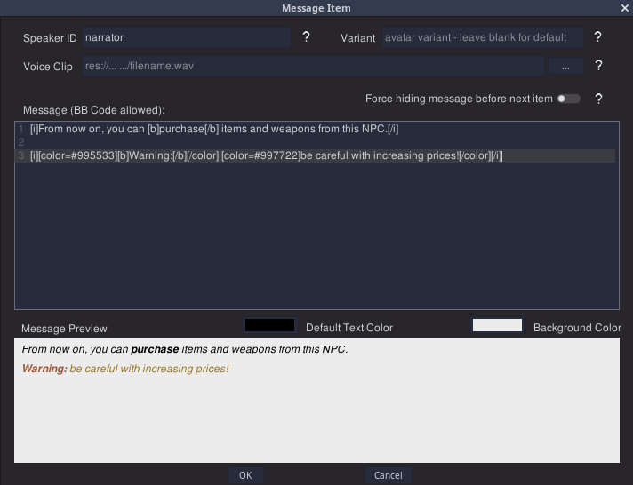

# MadTalk - A Feature-Rich Dialog System for Godot
_Empowering mad dialogs since June 2020_ _o/_

_This branch is the Godot 4.x version **starting at Godot 4.2** (due to changes in GraphNode). If you use Godot 3, check the `3.x` branch. For Godot 4.0 or 4.1, use the `4.1` branch._

&nbsp;

MadTalk is the dialog plugin behind almost all Mad Parrot games with dialogs, and some others. It's feature rich, genre and layout agnostic, focused on visual editing, beginner friendly (as possible) while remaining powerful enough for advanced users, can be used in any type of game and coupling it to game code or not is entirely your option. You can use it just to show some messages, or if you want you can go all the way into using it as a framework.

You can check a feature showcase in the [example project](https://madparrot.itch.io/madtalk-example-project) _(be aware that project is more than 2 years old, so if it feels outdated it's because it is)_.

If you want to play a game using MadTalk to see it in real life, one example is [Ciara and the Witch's Cauldron](https://subvertissement.itch.io/ciara-and-the-witchs-cauldron).

Other dialog plugins are made to be very generic and neutral, which is good in itself, but might be daunting (or even confusing) for beginners. MadTalk on the [otter hand](docs/otter_hand.png) is not afraid of getting specific, and thrives in its unique set of features (some which are specifically helpful for some game genres) putting it aside from average dialog systems around. The strong points are:

&nbsp;

### Compact Visual Editor 
  
  * Editor uses visual nodes (dialog diagrams don't look like Scratch software)
  * Visualizing diagrams is very compact, screen space used is clean and neat due to the _sequence_ model: all blocks of dialog have a main path, and everything which doesn't branch from main path is a _sequence_, shown in the same node as a stack (visually similar to blender modifier stack)
  * Layouts are not cluttered with lines all around, only uses lines for actual branching between sequences (no separate nodes for `if`s, setting variables, etc)
  * Dialog sequences are organised in sheets, which are exactly what it says on the tin. Any point of any dialog can jump to any point of any other sheet without needing lines
  * Editing messages includes a panel for real time _bbcode_ visualization
  * Nearly all options and features anywhere in the plugin include a question mark button with a help popup explaining what that is and how to use it, so you don't need lots of documentation browsing to know how to use things
  

  
&nbsp;
  
### Offloads Game Logic (if you want)

  * Conditions and effects allow you to control the dialogs from within the dialogs, making designing it more intuitive (compared to code scattered around the project)
  * The dialog diagrams double as a form of visual scripting, so depending on the type of game (e.g. visual novels) you can bring a lot (or even all!) of game logic into it for free and reduce the coding effort
  * All of the above is optional, and MadTalk will not get in the way of your code if you prefer to do everything by hand. You can also have a middleground with best of both worlds, using custom conditions and effects triggering signals and evaluation methods to decide branching via your own code even in the middle of sequencing
  * Again, each condition and effect comes with their own question mark explaining the parameters
  

  
  
&nbsp;

### Full Feature Set for In-Game Time handling

This is the point where MadTalk excels: some games (iconic example being _Harvest Moon_ and life simulation visual novels) have an in-game time and calendar, actions spend time, and some dialog branches and game events are affected by it (e.g. something different happens if you talk to that NPC on a Saturday evening).

MadTalk has an entire subsystem to handle in-game time automatically for you:

  * A set of effects available in dialog sequences to advance time in several ways (adding time or days, moving clock/calendar to a certain time/date, stamping current in-game time into a variable)
  * A set of conditions for dialogs to branch, based on in-game time (several options for time/date range, and time spent since a timestamp from a variable)
  * In-game time controlled by MadTalk can be read and written by your code from anywhere so you don't have to rely on dialog effects at all for controlling and/or fine tuning it
  

There are more features, such as handling animations (with or without narration text), typing sounds, and some other bonbonnière. Again, you _don't have_ to use any of those features. If you want to just show some message sequences in the game UI, it will work too and will not get in your way. 

Also, as is customary in dialog plugins, you can also have ye olde conditional text inside message content as well, but they can't branch the sequences if they are inside text. They only change what is shown in the message.

----
&nbsp;

## Documentation

To see how to use and full documentation, check the [**DOCS**](docs/help.md)