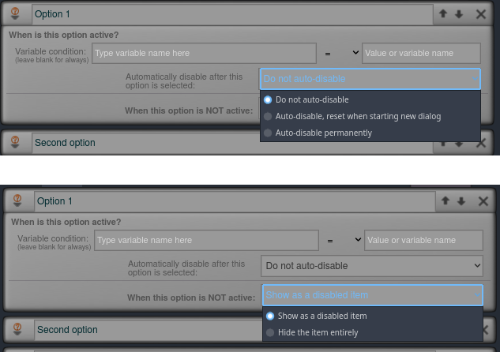

# MadTalk - A Feature-Rich Dialog System for Godot


## Usage

You need four steps:

  * Obviously, install the plugin and activate it. You only need the `res://addons/madtalk` folder
  * Create a set of `Control` nodes to show the dialog messages (examples further below)
  * Put a `Node` in the scene holding the runtime script, set the values you want and tell it which `Control` nodes to use (the ones you created above)
  * Add at least two function calls somewhere in your code called in the node mentioned above: `start_dialog("sheet id")` to fire a dialog sheet, and `dialog_acknowledge()` to progress the dialog (usually pressing space, enter, clicking mouse, etc)

After that, you can have fun doing actual dialog design in the editor, provided as an extra tab in the very top of the engine.

&nbsp;

### The MadTalk Node

Each scene which shows dialog must have a node with the MadTalk runtime. That is a node of the type `Node`, put anywhere in your scene, which will access the UI nodes, emit signals, and where you set options in the inspector. That is also where you set your character names and avatars (which is optional by the way).

Why is this node not a singleton? Because you might want to have different settings for different scenes. E.g. you might have a scene in your game which is _The Beach Episode_ where the character avatars show sunglasses and swimsuits, UI nodes have a different layout, a separate set of animations, etc. The [example project](https://madparrot.itch.io/madtalk-example-project) shows an extreme case of this, as the game has four scenes: a text game, a visual novel, a top down 2D RPG, and a 3D first person. All share the same dialog sheets, NPC IDs, etc, while being visually and mechanically completely different games. This is done on purpose to showcase the independence between the plugin and the game style.

Add a `Node` to your scene (in this readme it will be named `MadTalk`) and attach the `res://addons/madtalk/runtime/madtalk_runtime.gd` script to it.

This will give you _a lot_ of options. Don't worry, you can ignore most of that. For a minimal setup you need to worry about only three - the bare minimum control nodes.


**Note:** _The runtime node was reorganized and the properties are now inside neat groups, so you only see the categories you expand._


_The documentation below still has screenshots from an older version without grouping - but the fields are the same, and work the same way._


&nbsp;

### Control Nodes

MadTalk uses `Control`-derived nodes as UI. If your game is based on a `Node2D` scene, you'll need a `CanvasLayer` to hold them (as the viewport coordinates in Controls and 2D camera are incompatible). But if your scene is based on `Control` nodes (e.g. point-and-click, visual novels, etc) or `Spatial` (all 3D games) you don't need this, just place the dialog UI nodes anywhere convenient in your tree and they'll work.

As a _bare minimum_, you need three nodes: 
  * A top dialog node, to hold _all_ dialog stuff inside. The rule is: hiding this node must make all dialog-related stuff disappear. It can be any `Control`-derived type. I like to use a `Control` aligned to `full rect` covering the viewport with mouse filter to `stop` so the player can't click on anything in the scene while the dialog is on screen - but that's a personal preference
  * A message box, similar concept as above, except this is only for messages (not including menus, standing pictures, etc - but does include name and avatar, if any). Hiding this should be enough to make all message-related things disappear. It can be any `Control`-derived node, but this node usually is the message rectangle (holding text, avatar, name labels, etc) so it's common for it to be a `Panel`, `TextureRect` or `NinePatchRect` (but doesn't _have_ to be)
  * A `RichTextLabel` to hold the actual message text (it was designed to be a `RichTextLabel` even if you don't use _BB code_, and compatibility with a common `Label` is not garanteed)
  
You can have anything else you want inside those nodes, for decoration, UI, etc. MadTalk will only touch the nodes you tell it to. Also a node being inside another (e.g. the message label inside the message box) doesn't mean they have to be _immediate_ children - you can have a very complex hierarchy there if you want. They just have to be inside of it somehow.
  
  


Drag and drop the nodes to the `MadTalk` node as below, and you're set.


For this bare minimum setup, the dialogs should not use menu options (as there are no nodes set for that).


Visually, this game will run very dry, while in a final game you want messages to show up and hide in a juicy way. In another section you'll see how to automatically call animations for that.

&nbsp;

#### Menus

If you want to have menu options handled automatically in your dialogs, you need two more nodes:
  * A menu box, similar to the message box (and sibling to it, that is, it's also inside the top dialog node), where hiding this node hides all the menu-related stuff. Like the message box, this would normally be a `Panel`, `TextureRect` or `NinePatchRect` (but doesn't _have_ to be)
  * A container node, the type being one of the automatic layout containers (`VBoxContainer` being the most common, but could also be `HBoxContainer`, one of the flow containers, etc)

Naturally, drag them to the `MadTalk` node so it's aware of it.


That's it.

If this is all you do, your menus will already work and you're good to go. See next session to make your first dialog sheet.

_Optional:_ You can have MadTalk automatically handle showing previously selected options in a different way. You can read more about that later.

_Optional:_ You'll notice the button shown in your menu when you run your game is the default Godot `Button`, which might not be the aesthetic you want in your game. You can have a custom button instead: prepare a nice node to your liking (one of the `Button`-derived classes, like `Button` itself or `TextureButton`), save that button as a separate scene file, and drag and drop that scene file to `MadTalk`'s `Dialog Button Scene File` property, and that one will be used for your menus instead of the default one. Again, entirely optional. Just for testing, leaving that field blank will use Godot's default button.

_Advanced: if you want to use as menu option a scene which is not even a button (something complex, even), all you have to do is create an `export` variable in there (with setter function) to set the text, and a signal emitted when the option is selected, and then set `MadTalk`'s properties `Dialog Button Text Property` and `Dialog Button Signal Name` to match those._

_If instead of all of this above you prefer to manage your menus entirely yourself in code, you can do that with custom menus, explained further down somewhere in this readme._

Now all you have to do to test the system is making some dialogs.

&nbsp;

### Designing Dialog Sheets

Dialogs are made of sheets (really like sheets of paper) which are the diagrams. Sheets contain sequences, which are the node blocks you can drag around. Each sequence has a list of items inside, which can be a:
  * Message
  * Effect
  * Condition
  * Menu option

When the dialog sequence runs, the items will run from top to bottom (except, obviously, menu options).

When you first open the dialog editor, you'll probably see this:


The right side panel shows the current sheet, the list of existing sheets, and a button to create a new sheet (you can collapse this panel). The rest of the screen is the sheet which is currently open.

When you just create a new sheet, it comes with the first sequence. All sequences have a numeric ID (you can't change that). By default all dialogs start at the sheet's sequence ID `0`, so this one has the `START` title to remind you. On the top bar of the sequence you can create new items and set the menu options.

Sequences don't need to have any menu options, but if they do, each sequence can have only one menu and is always in the end. This is because one sequence means one path without branching out, and menus necessarily branch because there is no "default" option, so they end the sequence.


In the plus icon, you can create messages, conditions and effects.

After you create any of them, you can right click the item to edit, reorder it in the sequence, or remove.


You can also reorder (or move the item to a different sequence) by dragging it to the new place.

In the menu options icon, you can set the menu options for this sequence. If you don't have any, the menu will be replaced by a default "Continue" output, which you can connect to any other sequence to continue the dialog. If you set options, MadTalk will work the menu for you in the end of this sequence, and branch accordingly. The sequence will show one output for each of the options, for you to connect to other sequences in this sheet.


You can click the tiny condition icon in the left of a menu option to set a condition which is required to show that button. (Menu option conditions are limited to variable comparisons.)


If the condition is not met, you can choose if either the button will show as disabled, or the menu will show as if that button didn't exist. Each separate option can have its own configuration.

You can also mark a specific option to auto-disable itself when it's selected, even if it doesn't have any variable condition at all (fields blank). It will still be treated as a conditional option as long as the conditions panel is left open.




To create a new sequence, right click on any empty space. To connect them, just drag an output from a sequence to an input of another sequence. Connecting a sequence to itself _is valid_, but only do that if you know what you're doing.

&nbsp;

### Characters, Names and Avatars

You can put a `Label` inside your message box (not the top dialog node) to show the speaker name (the character who is saying the message), and drag that to `Dialog Speaker Label`. Similarly, you can place a `TextureRect` somewhere inside the message box to show the avatar, and drag it to `Dialog Speaker Avatar`. They don't have to be _immediate_ children of the message box node, but have to be inside of it (same applies to the message label).


So far, we don't have any characters set. _The dialogs will already work_ (even without the name label and avatar). They already work even with just the first three nodes. If you create a dialog sheet, put some messages, and fire it with `$MadTalk.start_dialog("some sheet id")` (and use input to confirm via `$MadTalk.dialog_acknowledge()`), the messages will show properly, and if you have name label and avatar nodes, the name label will show the speaker ID and the avatar will be empty. For very simple games without avatars this is fine, just use the speaker ID field as name (or not even that if you only have narrator, or another way to indicate the speaker, like dialog bubbles).

To show avatars we have to create a list of characters, in `MadTalk`'s first property. Set the number of how many characters you'll have in this scene, and for each of them create a `MTCharacterData` resource. You'll see each one of them has `ID`, `Name`, `Avatar`, and `Variants` fields.

  * `ID` is the speaker ID you type when writing the messages in the dialog editor
  * `Name` is what you want to show up in the name label
  * `Avatar` is a _default_ avatar, shown when no variant was specified in the dialog. For many games this is the only one you need
  * `Variants` are a list of different avatars for the same character. They can be emotions (happy face, sad face, etc), or could be an entire different interpretation, up to you (e.g. healthy, hurt, tired, different clothes, etc). This is a dictionary where the keys are Strings (the variant ID) and the values are the images. Using variants is _entirely optional_ and you can ignore for now


When you edit a message item, there are the `Speaker ID` and `Variant` fields you use to specify who says that message (see below). They will be taken from the `MadTalk` node _where the dialog was invoked_ (where you called `start_dialog()`), so you can have different character lists in different scenes. (You could even have multiple runtime nodes in the same scene, but I never did that and see no use for it anyway... but it would work.)

 


&nbsp;

### Voice Clips

Each text message can also specify a voice clip (see above), which is the `String` path for an audio file in your project. MadTalk will not _play_ it automatically, it will instead _emit a signal_ passing that as argument. All you have to do is connect that signal to a method of yours, where you load (consider preloading) that clip into an `AudioStreamPlayer` or similar and play it.

The reason why MadTalk doesn't handle audio itself internally is because you might want different ways of doing it, such as some audio bus routing. Also e.g. for a visual novel, it would be indeed an `AudioStreamPlayer`, but for a 3D game you might want to use the speaker ID to select the `AudioStreamPlayer3D` belonging to the NPC node in the 3D world, so the voice will come from that direction in the 3D sound.

&nbsp;

### Juicy Dialogs - Transition Animations

The `MadTalk` node has two property slots for `AnimationPlayer` nodes. One of them is used internally to make dialogs juicy, the other one holds animations you can call yourself from the dialog sheets via effects (will be explained later on).

If you want dialog animations, you should create an `AnimationPlayer` node (good practice to put it inside the top dialog node), possibly called `DialogTransitions` or something more to your liking, drag it to `MadTalk`'s `Dialog Animation Player` property, and create a few animations in it, to handle the transitions.

There are four pairs of animations used, each pair handles showing (fade in) and hiding (fade out):
  * `Transition Animation Name Dialog` is the name of the animation pair to show and hide the top dialog node. This normally doesn't have to be fancy. In most cases, your visible nodes will be inside the message and menu boxes, it's actually rare for something else to be visible in the dialog top node, but it's possible (like vignetes, decoration, or a background made darker or blurry, etc). I sometimes use the top dialog node as a `ColorRect` set to black with some alpha transparency, so it makes the game scenario a darker background while the dialog is going on
  * `Transition Animation Name Message Box` is the name of the animation pair showing and hiding the message box, assuming the top dialog node is visible (_don't control both in the same animation!_). This is one of the animations the players will see the most (other one being the text)
  * `Transition Animation Name Menu` is similar to above, but showing and hiding the menu box instead (again assuming the top dialog node is visible)
  * `Transition Animation Name Text` is used to gradually show the text (it can be a typing effect, or fading in, or something else, there are no requirements). This is one of the animations the players will see the most (other being the message box). You _don't need to do this manually_, see below


The text animation name option is there in case you want a custom one, but you don't need to do that yourself. Instead you can use the automatic typing animation, which is handled internally with Tweens. All you have to do is enable the `Animate Text` property, and configure the speed in `Animated Text Milisecond Per Character`, and MadTalk will do all the magic for you. If you also want a typing sound playing during that animation handled automatically for you, you can put an `AudioStreamPlayer` node (maybe inside the top dialog node), set it with a typing sound effect (set to loop), and drag that node to `MadTalk`'s `Key Press Audio Stream Player` property. And done, typing animation _and_ typing sound done automagically for you.

&nbsp;

### Effect Animations

You can have a separate `AnimationPlayer` node (maybe called something like `EffectAnimations`), which you can easily invoke from the dialogs. Just drag it to the `Effects Animation Player` property. One of the dialog effects is called `Play Animation and Wait`. If you use this effect (specifying an animation name), that animation will be played from _this_ animation player, and the dialog will pause until this animation is complete.


You can, of course, play any animation from anywhere (waiting for completion or not, up to you) manually, invoked from the dialog sheets using custom effects (shown later on). But using the `Effects Animation Player` property involves no coding at all.


&nbsp;

### Message Formatting

You can optionally set a prefix in `TextPrefixForAllMessages` and/or a suffix in `TextSuffixForAllMessages`. As the names imply, this will be text placed around all your messages, from all sheets, all speakers and variants. Only use this for things which are universal to your message logic.

You can use any code formatting from the messages (more on this later on _Dialog Variables_) inside the prefix and suffix as well - and that's why it's a powerful feature.

Example, assume you have:
  * A speaker ID `la` (with character data mapping to name `Lalala`)
  * `TextPrefixForAllMessages` set to: `[b][color=red]$speaker_name:[/color][/b] [i]` (notice it's using a `$speaker_name` code)
  * `TextSuffixForAllMessages` set to: `[/i]` (every BB Code you open in the prefix you have to close in the suffix)

Then, this message item:


Will have the text rendered as:


This is useful in text-only games where you want the dialog to look like a book dialog line, or a mobile phone messaging app, without having to type the speaker formatting all the time.

(If you want the dialog messages to _persist_ into a text log, instead of content being replaced on every message, you can use the `message_text_shown` signal to append text to the log instead of assigning a label to the `DialogMessageLabel` property. See signals below.)

&nbsp;

### Auto Show Menu On Last Message

Every text message requires interaction (acknowledgement) from the user before moving to next item, and that includes any menus. So the user sees the message, acknowledges it, then the menu appears.

Enabling this checkbox, the menu will show automatically as soon as the text from the last message item becomes fully visible.


&nbsp;

### Modulate Previously Clicked Options

When using the built-in menu handling system, you can automatically modulate buttons for options the player has already previously selected.

You have two properties for that: one is used when the option was already picked since the last time the dialog was invoked (via `$MadTalk.start_dialog()`, and the other is for options which were selected in the past in previous dialog calls.


&nbsp;

### Year of Reference

Finally, this last property you would only touch if you are using the in-game time features and you need to fine tune the calendar. In a nutshell, the only purpose of this is to align the weekdays and leap years to your liking. The in-game time will start at 01 January of the year 1 (you can change this, of course, via code). You don't have to show "year 1" to your players, you can manually add any value to this when showing the year in the interface (so e.g. you'd add 2467 if in your game's lore the year is 2468), but internally the game starts at year 1. Which weekday is in-game 01/01/0001? Which year will be the next leap year?

MadTalk will link your in-game Year 1 to one year of the real world, and that is the reference year. So if you leave the default `1970`, means the first day of your in-game time will be a Thursday, two years before the next leap year. Because 01/01/1970 was a Thursday and the next leap year was 1972. Players will _never_ see the reference year, the number `1970` will _never_ be used for anything in your game _whatsoever_. The _only_ purpose is to define the weekdays and leap years.

So, e.g. if you want your game's January 1st to be a Sunday, and the very first year of in-game time to be a leap year, you can check the real world calendar to find when it happened (in this case, `1984`) and use that as reference year.

If you're not using the in-game time features, then don't even bother about this field.


&nbsp;

### Custom Menu

If having a sequential container with buttons (e.g. `VBoxContainer` with a list of `TextureButton`) is not how your game works, and you want to manually assemble and control your menus from code, you can use the external menu feature. It uses a signal and a method call to interface your game code with MadTalk. To use the external menu feature, simply don't assign anything to `Dialog Buttons Container`. If that field is empty, MadTalk will assume you're using custom menus.

If you're using that feature and the dialog reaches a menu, MadTalk will not handle the buttons, instead it will emit the `external_menu_requested` signal passing two `Array` arguments: the list of options the menu should have (as `Array` of `DialogNodeOptionsData` - a custom resource), and the metadata for those options (as `Array` of `Dictionary`). You do whatever you want with this information.


When your custom code decides which of the options should be selected, you call the `select_menu_option(option_index)` method, where `option_index` is the index of the option you selected, from the Array passed in the signal above.

As example, if you are using custom menu (`Dialog Buttons Container` is empty) and you run this sequence:


The `MadTalk` node will emit the signal `external_menu_requested` passing as first argument the `Array`: 

```gdscript
[<DialogNodeOptionData>, <DialogNodeOptionData>, <DialogNodeOptionData>]
```

where (assuming the argument is called `options`):

```gdscript
options[0].text = "Let's walk in the park"
options[1].text = "Let's eat a pão de queijo"
options[2].text = "Nevermind"
```

and a second argument containing (assuming you never clicked any of those options before):

```gdscript
[
    {"enabled": true, "visited": false, "visited_dialog": false},
    {"enabled": true, "visited": false, "visited_dialog": false},
    {"enabled": true, "visited": false, "visited_dialog": false}
]
```

The field "enabled" indicates this option has passed the conditions to be selected, and false when it should not be selected but is still marked to be visible as disabled. The field "visited" indicates this option was already clicked in the past during this gameplay, and the "visited_dialog" field indicates if it was selected since last call to `$MadTalk.start_dialog()`.

And if you want to continue the dialog with the player selecting "Let's eat a pão de queijo", you call:

```gdscript
$MadTalk.select_menu_option(1)     # Array indices start at 0
```


&nbsp;

### Dialog Variables

For many reasons (such as scope, avoiding spaghetti code, etc), MadTalk doesn't read your game code variables directly. Instead it has an internal `Dictionary` of dialog variables, and those are used in the effects and conditions, as well as in the message text. You can read and write them at any time from anywhere in your game code, explained further below (but changing them from outside when a dialog is already on screen might lead to Unexpected Behaviour :tm: ).

Conditions always expect variables to contain numbers (`int` or `float` are both acceptable). For now there is no condition to compare a variable to a `String`.

You can use dialog variables inside text messages in two ways: substitution and conditional text.

Substitution accepts numeric or String variables, and uses the syntax `<<variable_name>>`, example:

```
Hello, <<player_name>>!
```

Conditional text treats variables as numbers and uses the syntax `{{if variable operator value: text}}`, where `operator` is numerical comparison (`<`, `>`, `<=`, `>=`, `=`, or `!=`), example:

```
Hello{{if money >= 100: , milady}}!
```

Notice the equal operator is just one `=` (unlike `C`). Also the spaces around the operator and after `:` must be respected.

Substitution and conditional text can appear anywhere in the messages, in any quantity (just not nested). Conditional text can have substitutions. Unfortunately for now there is no `else` (it's planned, though).

You can use this for larger blocks of text as well, just be careful with spaces and new lines to avoid unnecessary blank spaces. Example:

```
Hello!
{{if money >= 100: Nice to meet, <<player_name>>.
It's great to see such a fine lady.
When I was young, my dream was to become someone as elegant as yourself,
but alas, here I am.
}}{{if money < 100: I haven't seen you before.
Are you sure your name is on the list?
You can't enter if it isn't.
}}
```

I consider improving this using GDScript evaluation for the conditions (or something similar), but it's low priority now. It's easier and more debug friendly to make separate sequences for those messages and use branching.

There are also some special variables used in substitution: `$time`, `$date`, `$date_inv`, `$weekday` and `wday`. You don't use the `<<>>` sintax for them, you just type them normally. They correspond to the fields from the in-game time dictionary, and meaning for them is explained further below in the section about signals.

You can also use `$speaker_id`, `$speaker_name` and `$variant` if you want to insert into the text the speaker ID, the corresponding speaker name (from the character data), or the variant, from the message item. 

While normally you only want your players to read the speaker _name_, the speaker ID or specially the variant can be useful in combination with message prefix/suffix. As example, imagine your dialog is happening via phone messaging, and you have the files:
```
res://images/icon_phone.png
res://images/icon_phoneold.png
res://images/icon_phonenew.png
```

You can set `TextPrefixForAllMessages` as `[img]res://images/icon_phone$variant.png[/img]` and in that case, if you don't provide a variant, the message will start with the `icon_phone.png` icon, but you can provide `old` or `new` as variants to cause the other two images to be used as icon instead. (If the variant is not found in the character data, it will not change the avatar.)


&nbsp;

### Globals

MadTalk _does have_ a singleton, called `MadTalkGlobals`. It handles dialog variables and in-game time, as those are shared across all scenes. Most methods and properties are in the `MadTalk` node in your scene, but some are in the singleton.

The following properties are in the `MadTalkGlobals` singleton:

* `is_during_dialog`: 

Exactly what it says on the tin. I use this one all the time to keep NPC and enemy AI in paused state during dialogs by simply adding an `if` at the start of their `_physics_process`:

```gdscript
func _physics_process(delta):
    if MadTalkGlobals.is_during_dialog:
        return
    
    # Rest of the code starts here
    # ...
```

Just be careful to handle animations which might be ongoing for them.

&nbsp;

* `is_during_cinematic`:

Name might be a bit misleading now, I swear it made more sense in earlier versions. This is true during the juicy animations from the `Dialog Animation Player` transition animations, as well as the effect animations played via the `Play Animation and Wait` effect.


* `time`: stores the in-game time in seconds since the start of the calendar (midnight January 1st year 0001). Modifications require calling a method, explained further below

&nbsp;

### Saving Dialog when Saving the Game

To save or load all the dialog states, check the `export_game_data()` and `import_game_data()` methods in the `MadTalkGlobals` singleton, explained below in the _Methods_ section.


&nbsp;

### Export Vars for Dialog Sheets

You might want to have nodes in your scene with `export` variables for dialog sheets, so you can give them a sheet ID in the inspector. 

E.g. you have a bunch of generic NPCs, and when you approach them and press `E` to interact, they fire a dialog. The script is the same, but different NPCs may or may not have separate dialog sheets.

You can put an export var named `madtalk_sheet_id` (or any name starting with `madtalk_sheet_id`) and MadTalk will do some inspector magic for you, showing a `...` button helping you select the sheet among the list of sheets you have.


&nbsp;

### Methods


For simple dialog games, you would use only two methods from the list below (to start a dialog sheet, and to acknowledge messages). For average complexity dialogs, you might also use the get and set methods for dialog variables. The remaining methods are very rarely used, if ever.

Called in the `MadTalk` node:

* `start_dialog(sheet_id: String)`: starts a new dialog, from the start sequence (ID `0`). If a dialog is already in progress, this one will be queued and start immediately when the previous one completes. If you want to start at another sequence, use the syntax below
* `start_dialog(sheet_id: String, sequence_id: int)`: same as above, but starts directly at the specified sequence ID instead of `0`. Use only if you know what you're doing, as it's easy to lose track of things 
* `dialog_acknowledge()`: if a message is still in the middle of showing text, causes the text to show entirely, immediately. Otherwise, progress the dialog to the next item
* `dialog_abort()`: interrupts the dialog, ignoring everything that would come after the current item. When I made this second version of the plugin back in mid 2020 I expected this to be useful, but 3 years and 26 published games and drafts later, and I never aborted a dialog ever
* `dialog_skip()`: when a dialog is skipped messages are not shown anymore, but unlike abort, all the dialog chain is still traversed, all conditions are checked and branched, animations are played and effects take place. This is important since game logic can be critically based on those effects, like setting variables, and also events e.g. if an effect in the end of a conversation spawns a boss, skipping the dialog still spanws the boss, while aborting doesn't
* `select_menu_option(option_index)`: when using external menu, selects the menu option by index
* `get_sheet_names()`: returns an Array of String with the IDs of all the sheets in the database

&nbsp;

Called in the `MadTalkGlobals` singleton:

* `set_variable(variable_name: String, value)`: sets the value for the dialog variable
* `get_variable(variable_name: String)`: returns the value for the dialog variable
* `export_game_data()`: returns a `Dictionary` with all the game data handled by MadTalk (dialog variables and in-game time), to be serialized for saving the game state
* `import_game_data(data: Dictionary)`: the reverse of the above, sets the dialog variables and in-game time based on a `Dictionary` previously exported by `export_game_data()`. If the data was exported _during_ a dialog, importing it will not suddenly show the dialog message where it was. There is no saved track of ongoing dialog. Avoid allowing the player to save the game in the middle of a dialog

Methods to control in-game time via code are being reviewed, as I want something very user friendly (which currently it is not). But for now, if you want to change the in-game time, you can (_carefully!!!_) modify the `time` property in the `MadTalkGlobals`, which contains the number of seconds of in-game time elapsed since the start of calendar (midnight of January 1st of year 0001). Just remember to call the `update_gametime_dict()` method afterwards, example:

```gdscript
# Moves the in-game time 45 days to the future
MadTalkGlobals.time += 45*(24*60*60) # 45 days * 24h * 60 min * 60 secs = 45 days in seconds
MadTalkGlobals.update_gametime_dict()
```


&nbsp;

### Signals


_**You don't need any signals at all**_ to use MadTalk.

&nbsp;

_All signals are optional._

&nbsp;

That said... they are a lot :sweat_smile:


The ones you'd use the most are the five below. Please notice the first two _are not real signals_. I mean, the signals exist in the inspector and you can connect things there, but MadTalk will not _really emit_ the signals. It will, instead, read which method you connected, and then call the method in the conventional way. This is so it can wait for yields and get the return value, which signals can't. If you connect more than one method in them, only the first one of each will be used.
 
&nbsp;

* `activate_custom_effect(custom_id: String, custom_data: Array of String)`: 

When using the effect called _custom effect_, it will call the method connected to this signal, passing as argument the data you entered in the corresponding edit dialog (e.g. `custom_id`=`"teleport_player"` and `custom_data`=`["city1"]`). 

`custom_data` can have multiple items (one per line you entered in the dialog editor).

The dialog _will wait_ for the method to finish, so if you have a `yield` in the method code, the dialog will wait for that `yield` (this is not a real signal).


&nbsp;

* `evaluate_custom_condition(custom_id: String, custom_data: Array of String) -> bool`:

One of the conditions is called _custom condition_, and it will call the method connected here. If the method returns `true`, the sequence continues, while if the method returns `false`, the dialog will branch out. The arguments work the same way as `activate_custom_effect`.

The dialog will pause and wait for the return value, so if you have a `yield` in the method code, the dialog will wait for that `yield` (this is not a real signal).

Example, a custom condition in a sequence, and the method connected to the `evaluate_custom_condition` signal:


&nbsp;

* `speaker_changed(previous_speaker_id: String, previous_speaker_variant: String, new_speaker_id: String, new_speaker_variant: String)`:

This is probably the most powerful of MadTalk's signals, emitted when the speaker ID or variant changed between messages. The arguments are the ID and variant for the last message as well as for the current message about to be shown. 

This can be used to modify the interface to match changes in speaker, e.g. to position the dialog bubble over the head of the character, or to show and hide (or highlight or blur) standing pictures, etc.

Example 1 - highlighting standing pictures:


&nbsp;

Example 2 - using variants to control message font:


&nbsp;

Example 3 - using speaker ID to point the camera to character:


&nbsp;

This signal is only emitted if one of the fields has actually changed (either different speakers, or different variants for same speaker).

Example, if previous message was from speaker ID `alice`, no variant, and next message has speaker ID `bob` with variant `happy`, the signal emitted will be:

```gdscript
speaker_changed("alice", "", "bob", "happy")
``` 

&nbsp;

* `voice_clip_requested(speaker_id: String, clip_path: String)`:

As explained in the _Voice Clip_ section earlier in this readme, this signal is emitted whenever showing a message with a voice clip set. The argument `speaker_id` is the speaker ID for the message, and `clip_path` is a String containing the path to the audio file. The method connected to this signal is responsible for playing the audio.

&nbsp;

* `external_menu_requested(menu_options: Array, options_metadata: Array)`:

As explained in the _Custom menu_ section, this signal is emitted when a menu is required but there is no node set in the `Dialog Buttons Container`property in the `MadTalk` node. Argument `menu_options` is an `Array` of `DialogNodeOptionsData` containing the menu options, and argument `options_metadata` is an `Array` of `Dictionary` with fields `enabled`, `visited` and `visited_dialog`.

&nbsp;


If the in-game time is relevant to your game, the signal below might be useful (e.g. showing clock on the UI):

* `time_updated(datetime_dict)`: emitted whenever the in-game time changes via dialog (not via code). Argument is a `Dictionary` with the fields:
  * `year`
  * `month`
  * `day`
  * `weekday` (numeric)
  * `weekday_name` (String)
  * `wday_name` - abbreviated version of `weekday_name` (String)
  * `date` - day and month, format international `dd/mm` (String)
  * `date_inv` - day and month inverted, format US `mm/dd` (String)
  * `hour`
  * `minute`
  * `second` (MadTalk doesn't work with seconds, will only be different from `00` if you modify by code)
  * `time` - hour and minute, format 24h `HH:MM` (String)

&nbsp;

Signals below are used very rarely, so if you're still getting started you can forget they exist.

* `message_text_shown(speaker_id, speaker_variant, message_text, force_hiding)`: 

Emitted when a message is about to be shown (but not yet), and the arguments are the values set in the message item. This can be used e.g. to keep a message log for the player to review past dialogs:


You can also use this signal to bypass MadTalk's default message showing system and implement your own without having to change the plugin source.

&nbsp;

* `dialog_started(sheet_name, sequence_id)`: emitted when a dialog starts. Arguments are the sheet ID and the sequence ID where it started

* `dialog_finished(sheet_name, sequence_id)`: emitted when a dialog ends. Arguments are the last sheet ID and the sequence ID where it ended. _NOT_ emitted when dialog is aborted (perhaps it should? Feedback appreciated)

* `dialog_aborted`: _this one_ is emitted instead if dialog is aborted

&nbsp;

* `dialog_acknowledged` and `text_display_completed`: 

When `dialog_acknowledge()` is called, its behaviour depends on if the text is already fully shown or not. If the text is still being shown, `dialog_acknowledge()` will cause it to be entirely shown instantly, and in that case `text_display_completed` is emitted. Otherwise, it will cause the dialog to proceed to next item, and in that case `dialog_acknowledged` is emitted. 

If the player doesn't interact and the text is shown to the end naturally via animation or Tween, `text_display_completed` is also emitted

&nbsp;

* `dialog_sequence_processed(sheet_name, sequence_id)`: emitted when a sequence is completed. The order of the sequences is _not_ respected (as they use recursive calls) and this signal will probably be revised

* `dialog_item_processed(sheet_name, sequence_id, item_index)`: emitted when an item inside a sequence is completed. The order is _not_ necessarily respected (as they use recursive calls) and this signal will probably be revised

* `menu_option_activated(option_id)`: emitted when a menu option is selected, either via internal automatic menu, or custom menu)


&nbsp;

----

&nbsp;

### Import and Export

You can export dialog sheets to external formats, and import them back (currently a text format is implemented, more coming in the future).

This is great not only to convert from other software, but also to send your dialog for translators, so they can "fill the blanks" with the new language and you can import it all back into MadTalk - the translated messages will land correctly into their respective message items.

In the case of the text format, it is a proprietary MadTalk syntax designed so you can write your dialog in a text editor (like a book) and MadTalk will create the sequences automatically for you.

As example, you can write the format below into Notepad, copy and paste into MadTalk. The plugin will build everything for you - either creating a new sheet or adding into the currently selected one - then creating a new sequence with 4 message items, and another new sequence with 2 items.

```
[Sequence]
alice: Hey Bob! How are you?
bob: I'm great! Not having any headaches at all lately.
alice: Nice! Good to know the unobtanium medicine is working!
narrator: (That was the last time Alice saw Bob alive.

[Sequence]
alice: I miss my friend so much...
alice: Anyways, time to go.
```

When you export existing data, codes are added so MadTalk knows what to do with them when you import back. Below is an example to be sent to a EN -> PT translator, automatically generated by exporting a sheet. Notice you're in control of which locale code format to use, like "en", "en-GB", "english", "my_little_string", or whatever you want (this is independent from Godot's locale list).

```

<p7b7y> player(curious): Hi there!
{pt}: Olá! E aí?

<5t1r3> innkeeper(happy): Allow me to introduce you to our cook, Peter!
{pt}: 

<2g6t7> peter(happy): Oh, hi there, [b]<<player_name>>[/b]!
{pt}: 

[Sequence: g28q7]

<n8wo2> innkeeper(suspicious): Hey! It seems you already met Peter!
{pt}: Oi! Parece que você já conhece o Pedro!

[Sequence: 7kkex]

<k2ilm> : -=-=-
[i](The inn kitchen only operates during business hours.
Please come back between [b][color=blue]08:00[/color][/b] and [b][color=blue]17:00[/color][/b].)[/i]
-=-=-
{pt}: 

``` 

Nothing is saved to files. For best flexibility (and to not clutter your ` res://` or ` user://`), the importer/exporter expects you to copy-paste the text, from the exporter, or into the importer.


----

## Tips

  * If you want to save file size exporting the game, you don't need to include the whole plugin. The running game only needs the `res://addons/madtalk/runtime/` folder (hence the name and organization). You can place export rules to avoid the rest.
  
  * The dialog editor (`res://addons/madtalk/madtalk_editor.tscn`) **_works_** as a normal game scene inside a running game. You can use this to have an in-game dialog inspector in admin mode - just remember to call `setup()` in it, and manually implement a saving mechanism if you don't want it to be read-only.

  * If you have long streams of messages without menus or branching, instead of having them as a single, long sequence, break them down into several shorter sequences. It will have better performance (and is easier to follow on screen).


&nbsp;

----

&nbsp;

## Fun Facts

  * This is the _second_ version of this dialog system. The first version (early 2020) was originally part of a game, and looked awful ([Main editor](old_01.png), [Sequence editor](old_02.png)) - but had the same logic.

  * When I started years ago, it wasn't on version control (I was bad with git at the time), and before I could push it to bitbucket (where it was before being moved to github), I... lost my HDD. The drive died taking all in it. It would be the end of MadTalk... but [JohnGabrielUK](https://github.com/johngabrieluk) used the then-last plugin version in a game I had access to, and I recovered all the MadTalk files from that game's source. Phew.
 